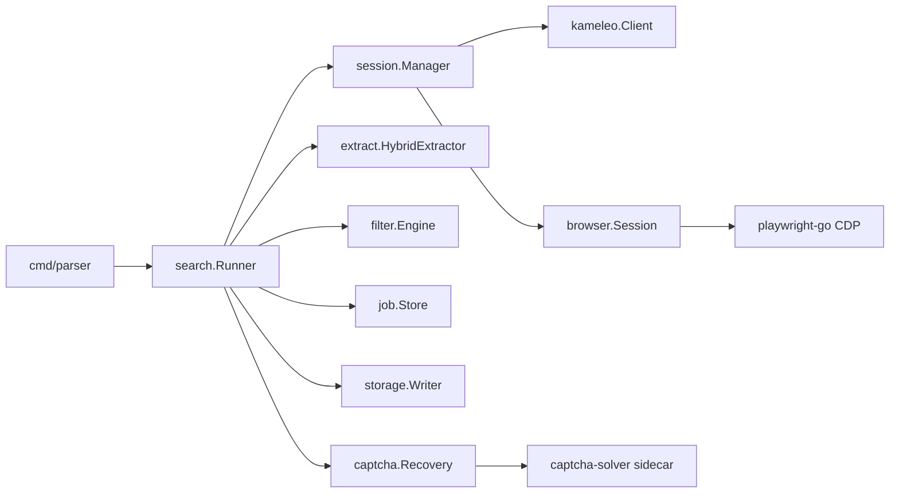

# Parser

Reliable Google search dork parser built in Go with Kameleo + Playwright (CDP) automation.

## Goals

- Execute Google dorks and collect **every** result URL without skips
- Track each search independently to reduce duplicate collection
- Hybrid extraction via DOM, Fetch/XHR hooks, and CDP network events
- Normalize, deduplicate, filter, and store URLs as single-line output
- Detect CAPTCHA/challenges with modular solver recovery
- Dynamic session/profile rotation without requiring static proxies
- Retries, timeouts, pagination, job resume, and structured logging

## Architecture



### Hybrid extraction

Each SERP page is parsed through three channels:

1. **DOM** – result anchors (`#search a[href]`, `div.g`, `data-ved`)
2. **Fetch/XHR hook** – init script captures outbound requests/responses
3. **CDP network** – Playwright response listener for non-Google URLs

All URLs pass through normalization (Google redirect unwrap, tracking param strip, canonical host/path) before dedupe + filter.

### Session/network management

Each dork request gets a unique request ID and dedicated Kameleo profile lease. Profiles rotate after configurable search/captcha thresholds or idle TTL. This provides dynamic session isolation without mandating proxies.

### CAPTCHA handling

Detection covers Google `/sorry/`, reCAPTCHA, Turnstile, and generic markers. Solvers are pluggable:

| Solver | Config value | Behavior |
|--------|--------------|----------|
| noop | `noop` | Fail fast with actionable error |
| manual | `manual` | Wait for human resolution |
| sidecar | `sidecar` | POST to Node sidecar (`captcha-solver/`) |

Recommended integration target: [Captcha-Sonic/puppeteer-solver](https://github.com/Captcha-Sonic/puppeteer-solver).

## Prerequisites

- Go 1.22+
- [Kameleo Engine](https://developer.kameleo.io/) running locally (`http://localhost:5050`)
- Playwright driver (installed automatically on first run)

Optional:

- Node.js 20+ for CAPTCHA sidecar

## Quick start

```bash
# Install Go deps
go mod tidy

# Install Playwright driver (first run only)
go run github.com/playwright-community/playwright-go/cmd/playwright@latest install chromium

# Run a single dork
go run ./cmd/parser \
  --config configs/default.yaml \
  --dork 'site:example.com filetype:pdf'

# Run dorks from file
go run ./cmd/parser --dorks dorks.txt

# Resume a job
go run ./cmd/parser --dork 'site:example.com' --resume <job-id>

# List saved jobs
go run ./cmd/parser --list-jobs
```

Results append to `output/results.txt` (one URL per line). Job state persists under `state/`.

## Configuration

See `configs/default.yaml` for:

- Kameleo endpoint and fingerprint selection
- Pagination limits and timeouts
- Retry/backoff policy
- Session rotation thresholds
- CAPTCHA solver selection
- Filter rules (keywords, domains, URL/path/query patterns, custom regex)

## Filtering

Filters are applied after normalization and before persistence:

- `include_keywords` / `exclude_keywords`
- `include_domains` / `exclude_domains`
- `include_url_patterns` / `exclude_url_patterns` (regex)
- `include_path_patterns` / `exclude_path_patterns` (regex)
- `include_query_params` / `exclude_query_params`
- `custom_rules` (regex matched against full URL)

## CAPTCHA sidecar

```bash
cd captcha-solver
node server.mjs
```

Set in config:

```yaml
captcha:
  solver: sidecar
  sidecar_endpoint: "http://127.0.0.1:8787/solve"
```

Implement `solveChallenge()` in `captcha-solver/server.mjs` using your preferred solver library.

## Project layout

```
cmd/parser/              CLI entrypoint
internal/
  browser/               Playwright CDP session
  captcha/               Detection + modular solvers
  config/                YAML configuration
  dedupe/                In-memory dedupe store
  extract/               Hybrid SERP extraction
  filter/                Rule engine
  job/                   Persisted job state/resume
  kameleo/               Local API client
  logging/               Structured logging helpers
  normalize/             URL normalization
  pagination/            SERP pagination
  retry/                 Retry/backoff utilities
  search/                Orchestrator
  session/               Profile lease management
  storage/               Single-line result writer
captcha-solver/          Optional Node CAPTCHA sidecar
configs/default.yaml     Default configuration
```

## Notes

- Kameleo provides fingerprint stealth; avoid stacking third-party stealth plugins on top.
- Use one browser context per Kameleo profile (Kameleo recommendation).
- Respect target site terms of service and applicable laws.

## Roadmap

- [ ] Wire Captcha-Sonic puppeteer-solver in sidecar
- [ ] SERP JSON response parser for additional coverage
- [ ] Metrics export (Prometheus)
- [ ] Concurrent dork worker pool with global dedupe
