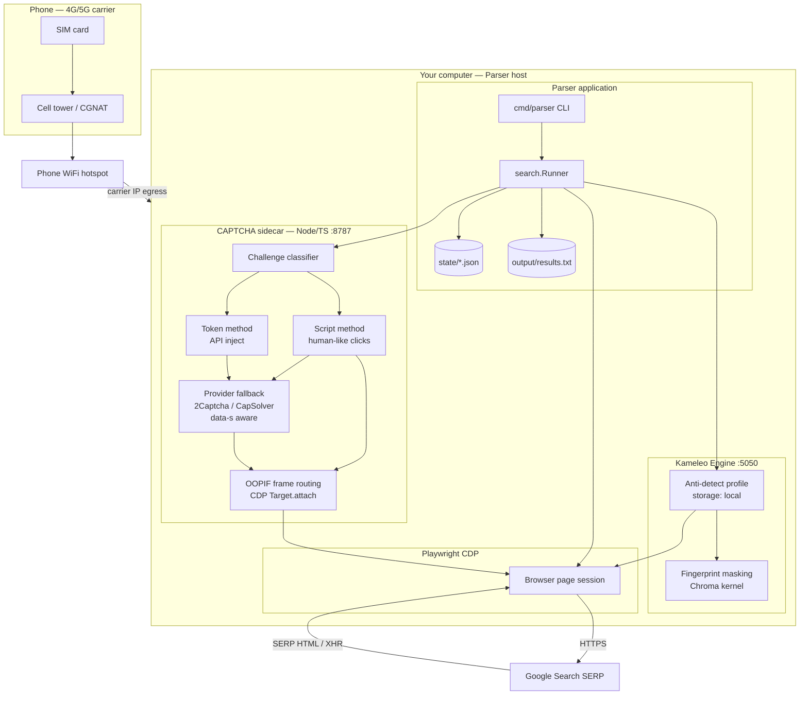
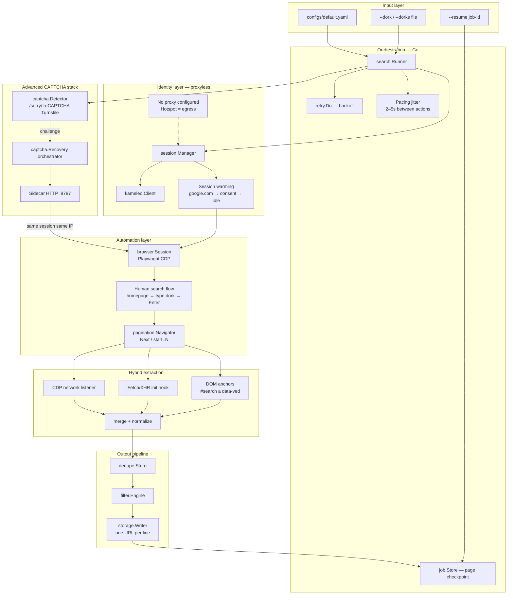
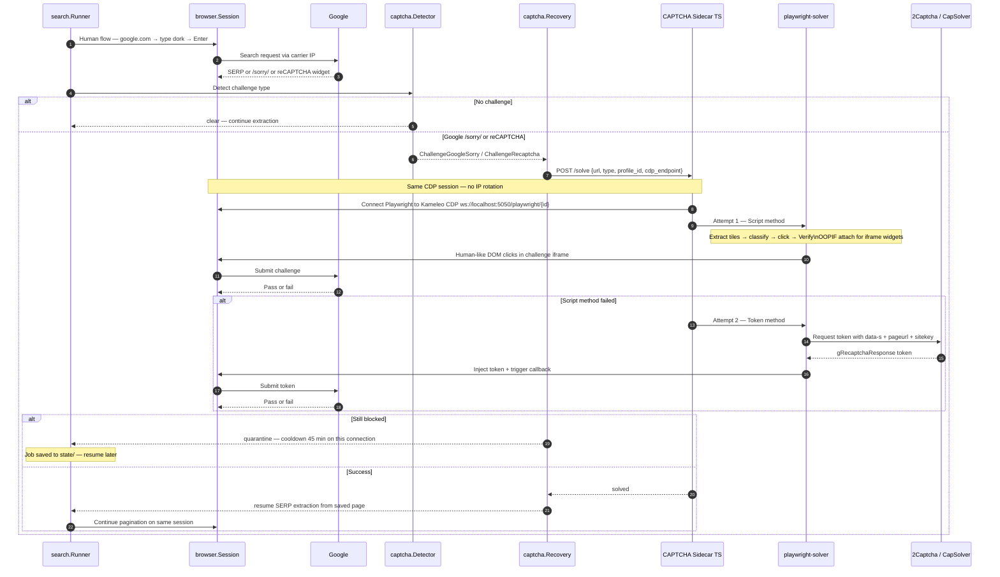
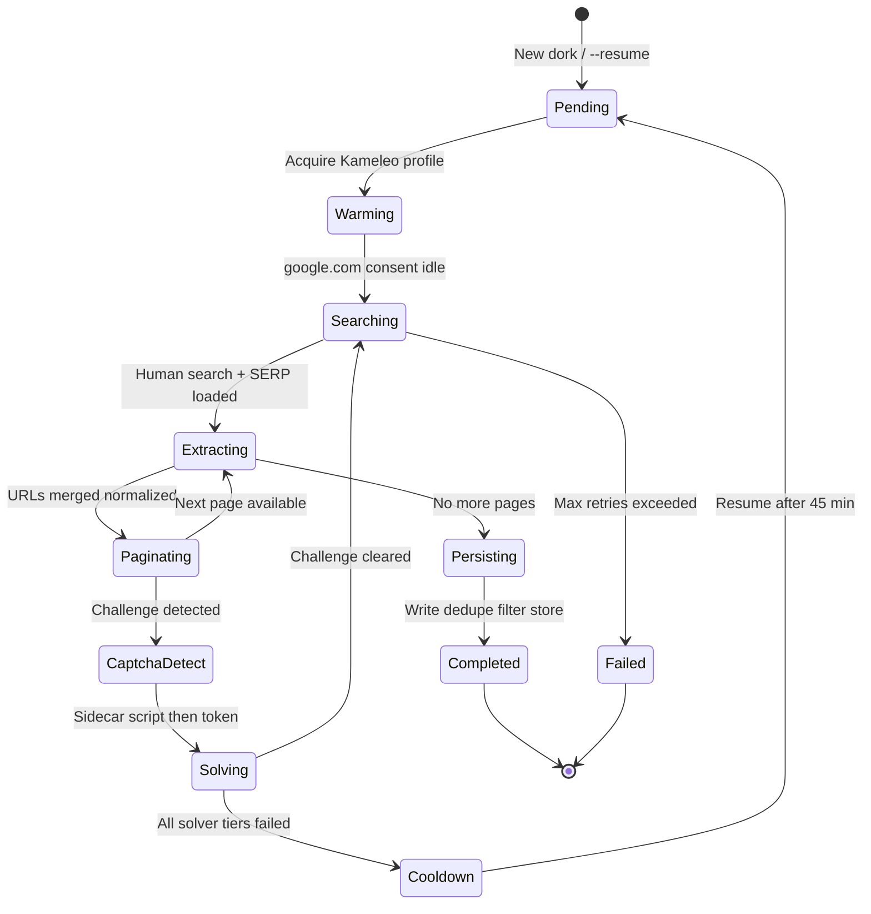
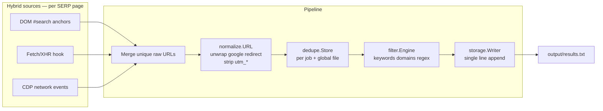
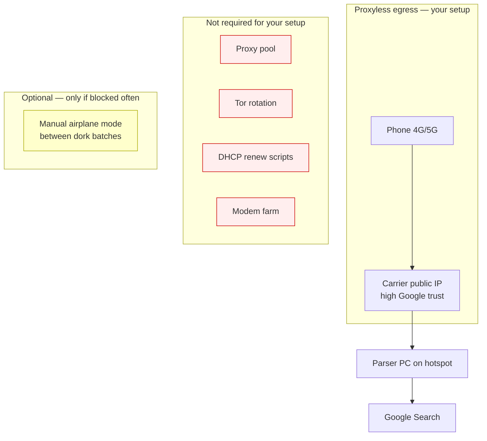

# Parser

Reliable Google search dork parser built in Go with Kameleo + Playwright (CDP) automation.

## Goals

- Execute Google dorks and collect **every** result URL without skips
- Track each search independently to reduce duplicate collection
- Hybrid extraction via DOM, Fetch/XHR hooks, and CDP network events
- Normalize, deduplicate, filter, and store URLs as single-line output
- Detect CAPTCHA/challenges with modular solver recovery
- Dynamic session/profile rotation without requiring static proxies
- Retries, timeouts, pagination, job resume, and structured logging

## Architecture

### Deployment context (mobile hotspot — proxyless)

Your PC routes all traffic through the phone’s carrier network. No proxy provider, no IP rotation scripts, and no Tor. Kameleo runs locally with **direct** egress via the hotspot.



### Application layers



### Advanced CAPTCHA recovery flow

Fully automated — no human in the loop. All solving happens on the **same Kameleo session and same hotspot IP** (required for Google `data-s` binding).



### CAPTCHA sidecar internal architecture

```mermaid
flowchart LR
  subgraph ingress [HTTP ingress]
    API["POST /solve"]
  end

  subgraph classify [Classification]
    C1[/sorry/ unusual traffic]
    C2[reCAPTCHA v2/v3]
    C3[Turnstile / CF]
    C4[GeeTest / AWS WAF]
  end

  subgraph primary [Primary — Captcha-Sonic playwright-solver]
    SM[Script method\n30–60s\nclicks tiles like human]
    TM[Token method\n5–15s\nAPI token inject]
  end

  subgraph advanced [Advanced techniques]
    OOPIF["CDP Target.setAutoAttach\nflatten:true — cross-origin iframes"]
    CB["Callback trigger\n___grecaptcha_cfg.clients"]
    DS["Google data-s extraction\nfor Search dialect"]
  end

  subgraph fallback [Fallback providers]
    C2C[2Captcha GridTask + clicks]
    CM[CapMonster Cloud SDK]
  end

  subgraph verify [Verification loop]
    V1[Re-detect page]
    V2{Challenge cleared?}
    V3[Return success]
    V4[Try next solver tier]
  end

  API --> classify
  C1 --> SM
  C2 --> TM
  C2 --> SM
  C3 --> SM
  C4 --> SM
  SM --> OOPIF
  TM --> DS
  TM --> CB
  SM --> V1
  TM --> V1
  V1 --> V2
  V2 -->|yes| V3
  V2 -->|no| V4
  V4 --> C2C
  V4 --> CM
  C2C --> V1
  CM --> V1
```

### Dork job lifecycle



### Data pipeline (URL collection)



### Network model — why no extra scripts needed



| Layer | Component | Role |
|-------|-----------|------|
| **Physical** | Phone hotspot | Carrier IP egress — proxyless |
| **Identity** | Kameleo profile | Fingerprint + cookie persistence |
| **Automation** | Playwright CDP | Human search flow + pagination |
| **Extraction** | Hybrid DOM/XHR/CDP | Zero URL loss |
| **CAPTCHA** | Sidecar: script → token → provider | Fully automated, same session |
| **Output** | normalize → dedupe → filter → file | Clean single-line URLs |
| **Resilience** | job.Store + retry + cooldown | Resume without re-scraping |

### Hybrid extraction

Each SERP page is parsed through three channels:

1. **DOM** – result anchors (`#search a[href]`, `div.g`, `data-ved`)
2. **Fetch/XHR hook** – init script captures outbound requests/responses
3. **CDP network** – Playwright response listener for non-Google URLs

All URLs pass through normalization (Google redirect unwrap, tracking param strip, canonical host/path) before dedupe + filter.

### Session management (hotspot mode)

Each dork gets a unique request ID. On mobile hotspot:

- **No proxy** is configured in Kameleo — the PC’s default route via hotspot is the egress
- Profiles use **`storage: local`** to persist NID/CONSENT cookies and build session trust
- Rotate profiles **infrequently**; prefer cooldown over aggressive rotation
- Keep the **same IP** for full dork pagination and CAPTCHA solving
- Optional manual airplane-mode toggle only if `/sorry/` persists after automated recovery

### CAPTCHA handling (advanced — fully automated)

Detection covers Google `/sorry/`, reCAPTCHA, Turnstile, and generic markers. The sidecar runs a **three-tier automated stack** on the same Kameleo CDP session:

| Tier | Method | Tool | Speed | Best for |
|------|--------|------|-------|----------|
| 1 | Script / human clicks | [playwright-solver](https://github.com/Captcha-Sonic/playwright-solver) script method + OOPIF | 30–60s | Image grids, checkbox, Turnstile widgets |
| 2 | Token inject | playwright-solver token method + `data-s` extract | 5–15s | reCAPTCHA v2/v3, Google Search dialect |
| 3 | Provider fallback | 2Captcha / CapMonster via [puppeteer-extra-plugin-recaptcha](https://github.com/berstend/puppeteer-extra/tree/master/packages/puppeteer-extra-plugin-recaptcha) | 15–45s | When script + token fail |

**Critical rule:** never rotate IP or Kameleo profile mid-CAPTCHA — tokens and sessions are bound to the hotspot carrier IP.

Legacy config solvers (noop/manual) remain available for testing:

## Prerequisites

- Go 1.22+
- [Kameleo Engine](https://developer.kameleo.io/) running locally (`http://localhost:5050`)
- Playwright driver (installed automatically on first run)
- **PC connected to phone mobile hotspot** (proxyless carrier egress)

Optional:

- Node.js 20+ for CAPTCHA sidecar (recommended for production)
- CaptchaSonic / 2Captcha / CapMonster API keys for tier 2–3 fallback

## Quick start

```bash
# Install Go deps
go mod tidy

# Install Playwright driver (first run only)
go run github.com/playwright-community/playwright-go/cmd/playwright@latest install chromium

# Run a single dork
go run ./cmd/parser \
  --config configs/default.yaml \
  --dork 'site:example.com filetype:pdf'

# Run dorks from file
go run ./cmd/parser --dorks dorks.txt

# Resume a job
go run ./cmd/parser --dork 'site:example.com' --resume <job-id>

# List saved jobs
go run ./cmd/parser --list-jobs
```

Results append to `output/results.txt` (one URL per line). Job state persists under `state/`.

## Configuration

See `configs/default.yaml` for:

- Kameleo endpoint and fingerprint selection
- Pagination limits and timeouts
- Retry/backoff policy
- Session rotation thresholds
- CAPTCHA solver selection
- Filter rules (keywords, domains, URL/path/query patterns, custom regex)

## Filtering

Filters are applied after normalization and before persistence:

- `include_keywords` / `exclude_keywords`
- `include_domains` / `exclude_domains`
- `include_url_patterns` / `exclude_url_patterns` (regex)
- `include_path_patterns` / `exclude_path_patterns` (regex)
- `include_query_params` / `exclude_query_params`
- `custom_rules` (regex matched against full URL)

## CAPTCHA sidecar

```bash
cd captcha-solver
node server.mjs
```

Set in config:

```yaml
captcha:
  solver: sidecar
  sidecar_endpoint: "http://127.0.0.1:8787/solve"
```

Implement `solveChallenge()` in `captcha-solver/server.mjs` using your preferred solver library.

## Project layout

```
cmd/parser/              CLI entrypoint
internal/
  browser/               Playwright CDP session
  captcha/               Detection + modular solvers
  config/                YAML configuration
  dedupe/                In-memory dedupe store
  extract/               Hybrid SERP extraction
  filter/                Rule engine
  job/                   Persisted job state/resume
  kameleo/               Local API client
  logging/               Structured logging helpers
  normalize/             URL normalization
  pagination/            SERP pagination
  retry/                 Retry/backoff utilities
  search/                Orchestrator
  session/               Profile lease management
  storage/               Single-line result writer
captcha-solver/          Optional Node CAPTCHA sidecar
configs/default.yaml     Default configuration
```

## Notes

- Kameleo provides fingerprint stealth; avoid stacking third-party stealth plugins on top.
- Use one browser context per Kameleo profile (Kameleo recommendation).
- Respect target site terms of service and applicable laws.

## Roadmap

- [ ] Wire Captcha-Sonic puppeteer-solver in sidecar
- [ ] SERP JSON response parser for additional coverage
- [ ] Metrics export (Prometheus)
- [ ] Concurrent dork worker pool with global dedupe
